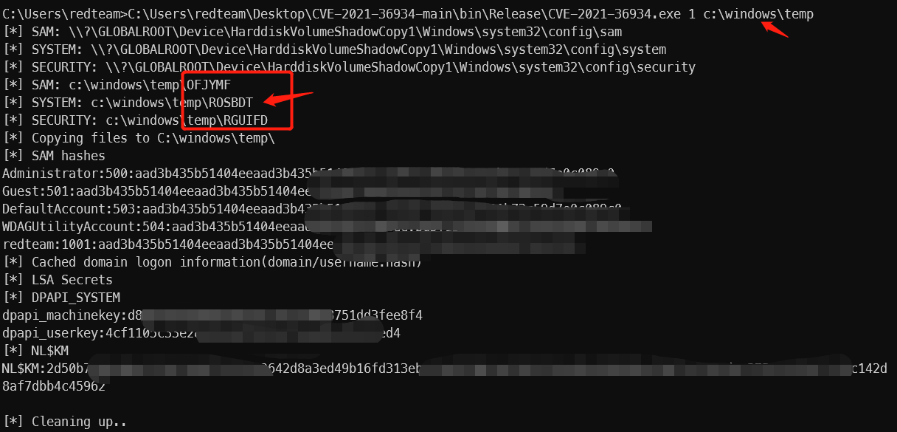
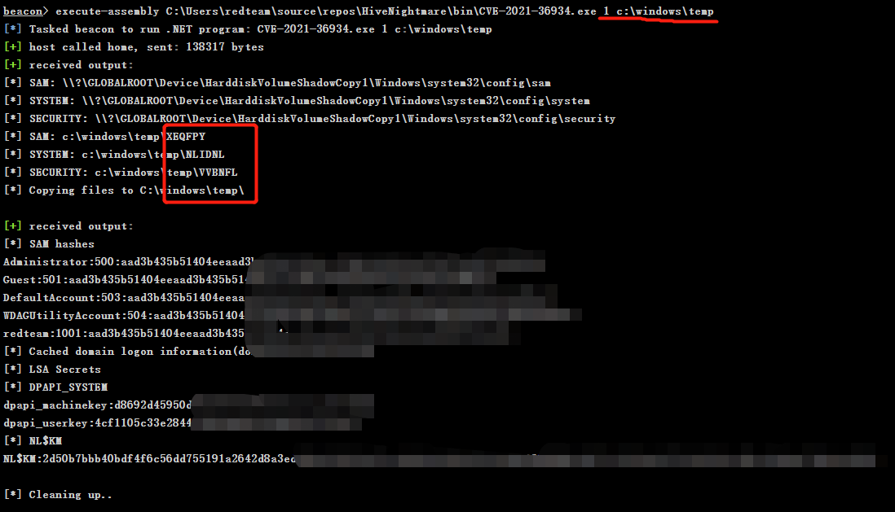

# HiveNightmare
HiveNightmare/SeriousSAM（CVE_2021_36934）

原始项目：https://github.com/cube0x0/CVE-2021-36934

### 做了以下修改:
- 增加了自定义文件复制路径
- 文件名随机字符（6个大写字符）

主要是对抗一些规则，例如：文件名检测等。

### 使用
参数：
```第一个参数：卷影备份的路径中的序号，参数为1，则是HarddiskVolumeShadowCopy1```
1. 普通使用
```xxx.exe 4 c:\windows\temp```
2. cobaltstrike使用
```execute-assembly C:\xxx\xxx.exe 4 c:\windows\temp```

### 演示



